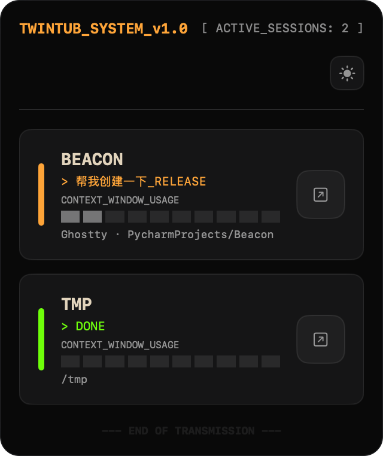
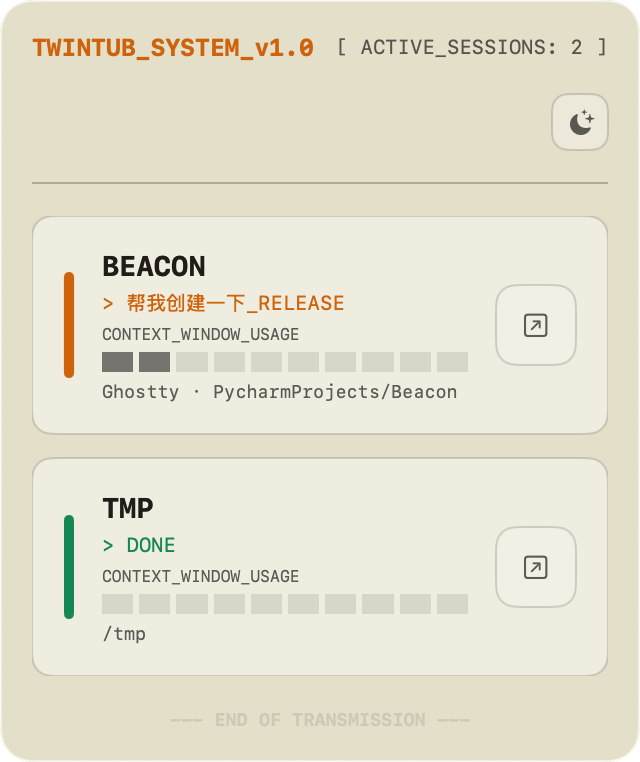

# TwinTub

[](https://choosealicense.com/licenses/mit/)
[](https://www.apple.com/macos)

**TwinTub** 是一个 macOS Menu Bar 应用程序，用于监控 Claude Code CLI 的多会话状态。它提供 "Native & Retro" 设计风格的沉浸式终端美学体验。

[English](README.md)

<p align="center">
  
  
</p>

## 功能特性

- **实时状态监控**：追踪空闲、处理中、等待、已完成状态
- **多会话支持**：同时监控多个 Claude Code 会话
- **终端跳转**：点击跳转回原始终端 Tab
- **系统通知**：会话需要关注或完成时获得通知
- **深色/浅色主题**：自动检测系统主题，支持手动切换
- **Context 使用可视化**：10段式进度条显示上下文窗口使用量

### 支持的终端

- **终端应用**：Terminal.app, iTerm2, Warp, Ghostty, WezTerm, Kitty, Alacritty, Tabby, Hyper, Rio, Kaku
- **IDE 终端**：Cursor, VS Code, Zed

## 安装

### 一键安装（推荐）

```bash
curl -sL https://raw.githubusercontent.com/Wangzehong111/TwinTub/main/install.sh | bash
```

### 卸载

```bash
curl -sL https://raw.githubusercontent.com/Wangzehong111/TwinTub/main/uninstall.sh | bash
```

### 手动安装

1. 从 [Releases](https://github.com/Wangzehong111/TwinTub/releases) 下载最新版本
2. 将 `TwinTub.app` 解压到 `/Applications`
3. 首次启动：右键点击 → 打开（未签名应用需要此操作）

### 从源码构建

```bash
git clone https://github.com/Wangzehong111/TwinTub.git
cd TwinTub
./scripts/run_twintub_app.sh
```

## 快速开始

1. **启动 TwinTub** - 应用会出现在菜单栏

2. **安装 Hooks**（监控所必需）：
   ```bash
   ./hooks/install_hooks.sh
   ```

3. **开始使用 Claude Code** - 会话会自动出现

4. **点击跳转** - 点击 Jump 按钮返回终端

## 开发

### 构建

```bash
# 使用构建脚本（推荐）
./scripts/run_twintub_app.sh --no-run

# 使用 xcodebuild
xcodebuild -scheme TwinTub -destination 'platform=macOS' build
```

### 测试

```bash
xcodebuild -scheme TwinTub -destination 'platform=macOS' test
```

### 健康检查

```bash
curl -i http://127.0.0.1:55771/health
```

### 模拟事件

```bash
./scripts/simulate_events.sh
```

## 架构

TwinTub 使用 **Sidecar 模式** 与 Claude Code CLI 集成：

```
┌─────────────────┐     ┌─────────────────┐     ┌─────────────────┐
│ Claude Code CLI │────▶│  Hook Bridge    │────▶│  SwiftUI App    │
│   (Terminal)    │     │  (Bash/cURL)    │     │  (Menu Bar)     │
└─────────────────┘     └─────────────────┘     └─────────────────┘
```

内部架构遵循 **Redux 模式**：

```
TwinTubEvent → EventBridge → SessionStore → SwiftUI Views
                  │              │
                  │              ├─→ SessionReducer (pure)
                  │              ├─→ SessionLivenessMonitor
                  │              └─→ NotificationService
                  │
                  └─→ Coalesce by session, 100ms flush
```

### 关键文件

| 文件 | 用途 |
|------|------|
| `TwinTubApp/App/TwinTubApp.swift` | App 入口，EventBridge，AppDelegate |
| `TwinTubApp/Core/Configuration/TwinTubConfig.swift` | 全局配置常量 |
| `TwinTubApp/Core/State/SessionReducer.swift` | 状态变更纯函数 |
| `TwinTubApp/Core/Store/SessionStore.swift` | 状态管理 |
| `TwinTubApp/Core/Services/SessionLivenessMonitor.swift` | 进程/TTY 验证 |

## 会话生命周期

会话通过双源真相管理：

1. **Hook Events**：驱动会话创建和状态更新
2. **Liveness Monitor**：每 5 秒通过 `ps` 快照进行后台验证

状态转换：
```
alive → suspectOffline (首次丢失) → offline (超过宽限期) → terminated
```

默认配置：
- **离线宽限期**：20 秒
- **终止后保留**：300 秒
- **硬性过期**：1800 秒

## 终端跳转行为

1. 尝试精确 TTY 匹配（Terminal/iTerm2）
2. 回退到在 `cwd` 打开源应用
3. 最终回退到终端选择器

## 许可证

本项目采用 MIT 许可证 - 详见 [LICENSE](LICENSE) 文件。

## 贡献

欢迎贡献！请阅读 [CONTRIBUTING.md](CONTRIBUTING.md) 了解指南。

## 致谢

- 使用 SwiftUI 和 AppKit 构建
- 灵感来自 "Native & Retro" 设计哲学
- 感谢所有贡献者
